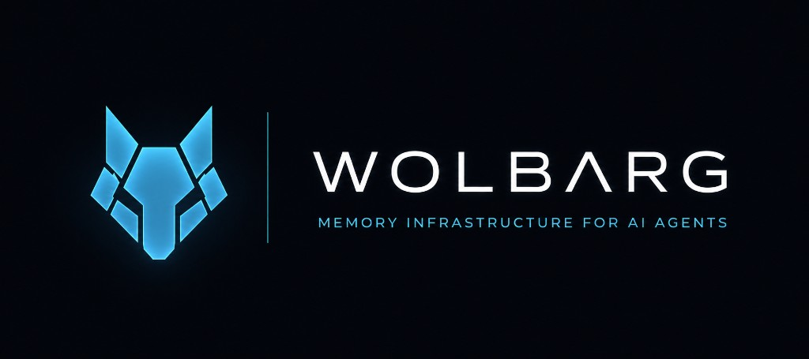

<p align="center">
  
</p>

# Wolbarg

**Modular, provider-agnostic semantic memory for AI agents (v0.3.0).**

[](https://www.npmjs.com/package/wolbarg)
[](./LICENSE)
[](https://wolbarg.com)
[](https://wolbarg.com/benchmarks)

## Benchmarks

**v0.2.1 Storage suite** (mock embeddings · scale quick) — dual-backend SQLite + PostgreSQL:

| Metric | Result |
| --- | --- |
| SQLite search @ 1k | **2.02 ms** |
| SQLite insert @ 1k | **1.72k ops/sec** |
| SQLite cold start | **7.91 ms** |
| Postgres 16 writers | **1.12k ops/sec** |

Storage (mock) ≠ LIVE (real providers). Full page: [wolbarg.com/benchmarks](https://wolbarg.com/benchmarks) · [methodology](https://wolbarg.com/docs/benchmarks) · [raw JSON](https://wolbarg.com/benchmarks/benchmark.json).

## Installation

```bash
npm install wolbarg
```

Node.js **22.5+**.

### Optional peers (install when you use the feature)

| Peer | Required for |
| --- | --- |
| `pg` | `postgres({ … })` storage |
| `pdf-parse` (pin `@1.1.4`) | `ingest()` of `.pdf` files |
| `mammoth` | `ingest()` of `.docx` files |
| `tesseract.js` | OCR provider for images |

```bash
# Example: PDF + DOCX ingest
npm install pdf-parse@1.1.4 mammoth
```

**Important:** these packages are **not** bundled with `Wolbarg`. If you call `ingest()` on PDF/DOCX without the matching peer, Wolbarg throws a configuration error at use time (not at import). Plain `.txt` / `.md` / `.csv` / `.json` need no extras.

## Quick start

```ts
import { wolbarg, openaiEmbedding, openaiLlm, bm25 } from "wolbarg";

const ctx = wolbarg({
  organization: "my-org",
  database: { provider: "sqlite", url: "./memory.db" },
  embedding: openaiEmbedding({
    apiKey: process.env.OPENAI_API_KEY!,
    model: "text-embedding-3-small",
  }),
  llm: openaiLlm({
    apiKey: process.env.OPENAI_API_KEY!,
    model: "gpt-4.1-mini",
  }),
  keywordSearch: bm25(),
  telemetry: {
    enabled: true,
    database: { provider: "sqlite", url: "./telemetry.db" },
    level: "debug",
    captureQueries: true,
    captureLatency: true,
  },
});

await ctx.remember({
  agent: "research",
  content: { text: "Stripe supports recurring invoices." },
  metadata: { topic: "billing" },
});

const hits = await ctx.recall({ query: "invoices", topK: 5 });
const explained = await ctx.recall({ query: "invoices", explain: true });
await ctx.checkpoint("before-compress");
```

`new Wolbarg({ storage: sqlite("./memory.db"), embedding })` remains supported for backwards compatibility.

## Quick start (legacy constructor)

```ts
import {
  Wolbarg,
  sqlite,
  openaiEmbedding,
  openaiLlm,
  bm25,
  meta,
} from "wolbarg";

const ctx = new Wolbarg({
  organization: "my-org",
  storage: sqlite("./memory.db"),
  embedding: openaiEmbedding({
    apiKey: process.env.OPENAI_API_KEY!,
    model: "text-embedding-3-small",
  }),
  llm: openaiLlm({
    apiKey: process.env.OPENAI_API_KEY!,
    model: "gpt-4.1-mini",
  }),
  keywordSearch: bm25(),
});

await ctx.remember({
  agent: "research",
  content: { text: "Stripe supports recurring invoices." },
  metadata: { topic: "billing" },
});

const hits = await ctx.recall({
  query: "recurring invoices",
  topK: 5,
  hybrid: true,
  filter: { metadata: meta.eq("topic", "billing") },
});
```

**Required:** `organization`, `storage` or `database`, `embedding`.  
**Optional:** `llm`, `telemetry`, `keywordSearch`, `reranker`, `ocr`, `vision`, `chunking`, `compression`, `retrieval`, `checkpoint`.

Calling `compress` without `llm` is a TypeScript error.

## API

| Method | Description |
| --- | --- |
| `remember` / `rememberBatch` | Store + embed |
| `recall` / `recallBatch` | Semantic / hybrid search (`explain: true` for diagnostics) |
| `ingest` | Documents → chunks → memories (**peers** for PDF/DOCX/OCR) |
| `compress` | LLM summary (needs `llm`) |
| `checkpoint` / `rollback` / `listCheckpoints` | First-party memory snapshots |
| `export` / `import` | Portable SQLite memory bundles |
| `forget` / `history` / `stats` / `clear` | Management |
| `ready` / `close` | Lifecycle |

## Studio

Local telemetry dashboard (separate app — not bundled into the SDK):

```bash
cd wolbarg_studio
npm install
npm run dev
```

Open http://localhost:3100 and connect to your `./telemetry.db`. Connections persist under the user config directory (`~/.wolbarg/studio.json` / AppData), never inside the project.

Telemetry SQLite files use an additive, versioned schema. On writable open, v1
files are migrated in place to telemetry schema v2 and retain all existing
events. V2 adds organization, agent, tags, checkpoint, persisted recall
explanations, and measured stage spans. `SqliteEventDatabase.query()` can filter
by `organization`, `agentId`, `tag`, and `checkpointId`; read-only access to an
unmigrated v1 file remains supported.

Full documentation: [wolbarg.com](https://wolbarg.com/docs/introduction)

## Limitations (v0.3)

- **Ingest peers are opt-in but required for those formats** — see table above.
- **PDF text layer only** via `pdf-parse`; scan/image PDFs need OCR/vision (or a text PDF). Older pdf.js in `pdf-parse@1.1.4` may reject some modern PDFs.
- **Node `node:sqlite` is experimental**; Node **22.5+** required.
- **Postgres** memory storage needs `pg`; telemetry/checkpoints are SQLite-only in v0.3 (interfaces ready for Postgres).
- **Not** an agent framework, chat UI, or hosted vector SaaS.

## Migration from 0.1 / 0.2

`init()` and `new Wolbarg({ storage })` still work. Prefer `wolbarg({ database, telemetry })`. LLM is optional. Schema auto-migrates to v2.

## License

MIT
